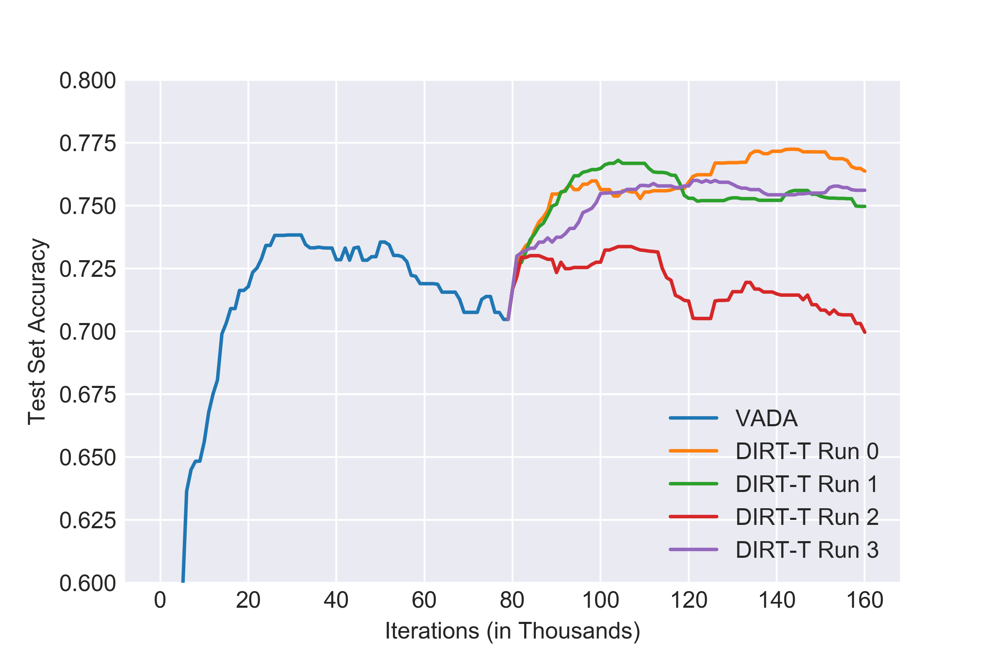
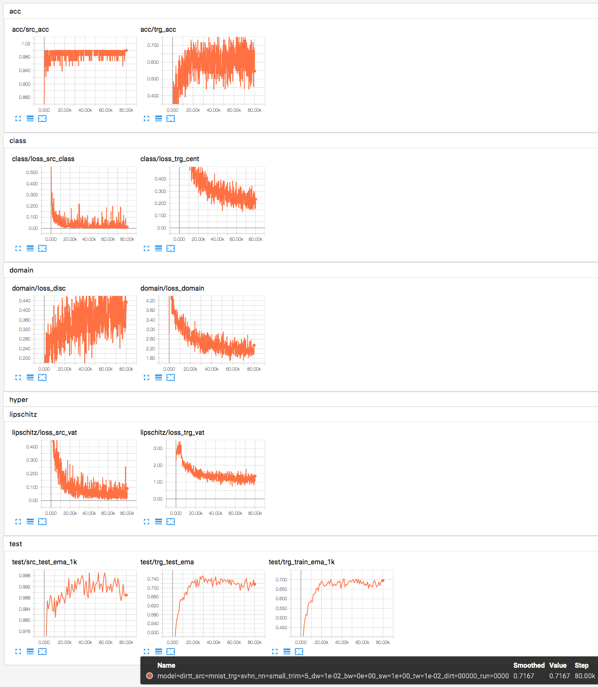

# DIRT-T

Implementation of [A DIRT-T Approach to Unsupervised Domain Adaptation (ICLR 2018)](https://arxiv.org/abs/1802.08735).

### Dependencies

```python
numpy==1.14.1
scikit_image==0.13.1
scipy==1.0.0
tensorflow_gpu==1.6.0
tensorbayes==0.4.0
```

### Download Data

Download scripts for MNIST and SVHN provided in `./data/`.

### Run code

Run VADA
```
python run_dirtt.py --datadir data --run 0 --src mnist --trg svhn --dirt 0
```

Run DIRT-T (pre-condition: run VADA first)
```
python run_dirtt.py --datadir data --run 0 --src mnist --trg svhn --dirt 5000
```

Tensorboard logs will be saved to `./log/` by default.

### VADA and DIRT-T Performance



Test run of a single VADA run on MNIST -> SVHN, and using the final VADA model as initialization for 4 separate DIRT-T runs. DIRT-T has higher variance but, on expectation, improves upon VADA.

### Tensorboard Visualization


